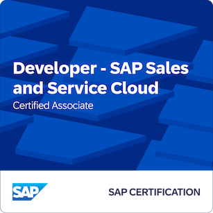
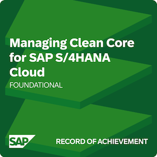
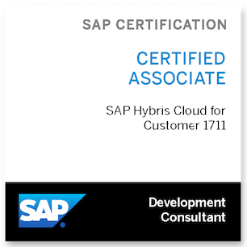

<h1 align="center">I'm AndreasFerdinand ...</h1>
<h3 align="center">... and I'm a passionate software developer from Austria</h3>

  

<h3 align="left">Most important private Websites I'm responsible for:</h3>

- [froeschler.net - Geschichten in Silbenschrift (german only)](https://www.froeschler.net)
- [silbenapp.froeschler.net - Text in Silbenschrift konvertieren (german only)](https://silbenapp.froeschler.net)

<h3 align="left">Selected Projects/Repositories:</h3>

- [ABAPFuck - a Brainfuck interpreter in ABAP](https://github.com/SRBConsultingTeam/ABAPFuck)
- [TransportTool - Export & download your SAP transports to files](https://github.com/SRBConsultingTeam/TransportTool)
- [CloudCopy - a command line tool to upload and download files to SAP C4C](https://github.com/AndreasFerdinand/CloudCopy)
- [Syllable.js - Javascript library to colorize syllables of words](https://github.com/AndreasFerdinand/Syllable.js)
- [Timerecording with CATS - andDogs](https://github.com/SRBConsultingTeam/andDogs)

<h3 align="left">My recent blog posts at <a href="https://blog.srb.at">blog.srb.at</a></h3>

- [Wenn SAP S/4HANA Stripe trifft: Nahtlose Buchhaltung dank innovativer Schnittstellen](https://www.srb.at/blog--events/technologie--abap/index.aspx?detail=316&hl=Wenn%20SAP%20S%2F4HANA%20Stripe%20trifft%3A%20Nahtlose%20Buchhaltung%20dank%20innovativer%20Schnittstellen)
- [Das Schreibtischladenproblem oder warum es gut ist, zu wissen, was man tut](https://www.srb.at/blog--events/technologie--abap/index.aspx?blog1_pager1_page=4&detail=219&hl=Das%20Schreibtischladenproblem%20oder%20warum%20es%20gut%20ist%2C%20zu%20wissen%2C%20was%20man%20tut)
- [Lieber ODATA als SAP GUI?](https://www.srb.at/blog--events/technologie--abap/index.aspx?blog1_pager1_page=5&detail=176&hl=Lieber%20ODATA%20als%20SAP%20GUI%3F)
- [SRB Workspaces: SAP Single Entry Point mit praktischen Extras](https://www.srb.at/blog--events/technologie--abap/index.aspx?blog1_pager1_page=8&detail=114&hl=SRB%20Workspaces%3A%20SAP%20Single%20Entry%20Point%20mit%20praktischen%20Extras)
- [The next Generation: ABAP RESTful Application Programming Model](https://www.srb.at/blog--events/technologie--abap/index.aspx?blog1_pager1_page=14&detail=43&hl=The%20next%20Generation%3A%20ABAP%20RESTful%20Application%20Programming%20Model)
- [Brainfuck, ABAP F***, WTF?](https://www.srb.at/blog--events/technologie--abap/index.aspx?blog1_pager1_page=16&detail=19&hl=Brainfuck%2C%20ABAP%20F***%2C%20WTF%3F)

<h3 align="left">Languages and Tools:</h3>
The progamming language, I spent most of my time is ABAP :nerd_face:.

                

<h3 align="left">Certifications & Trainings (selection)</h3>

